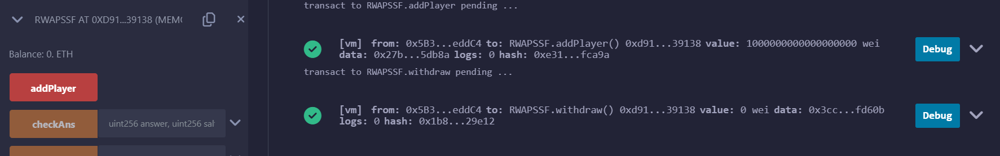
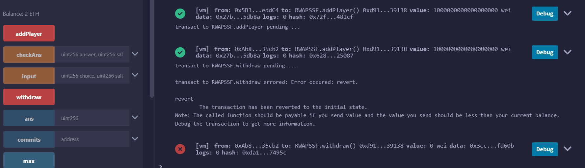
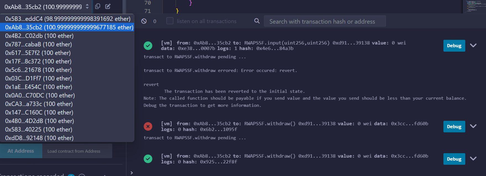
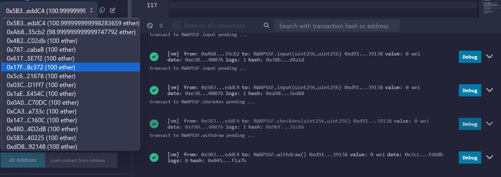
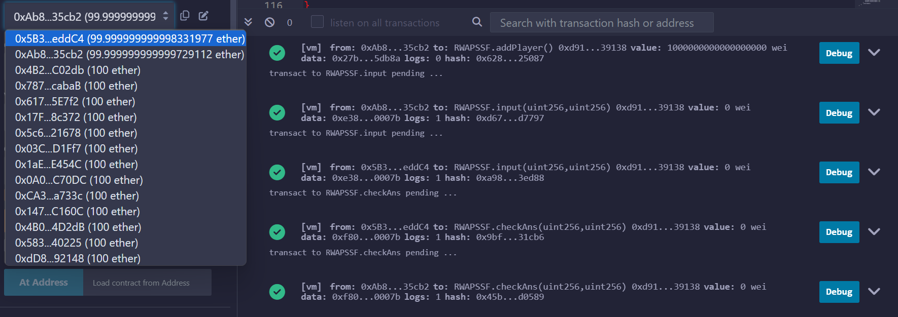
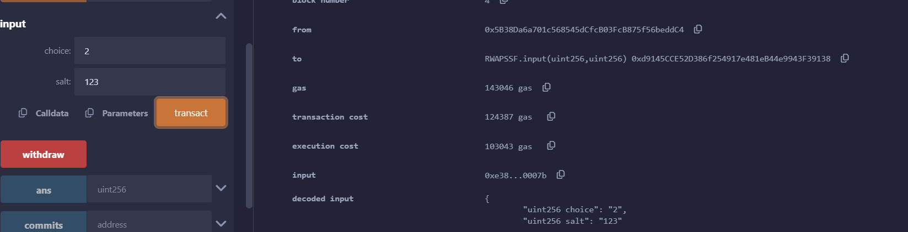
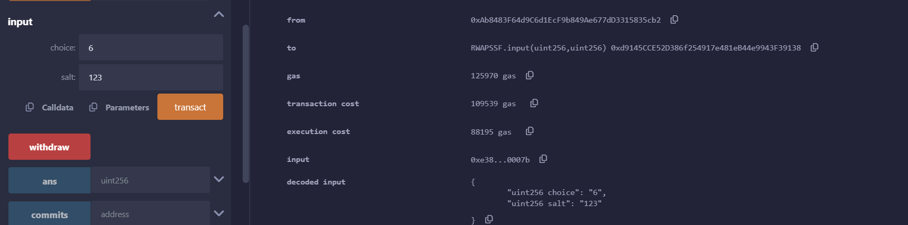
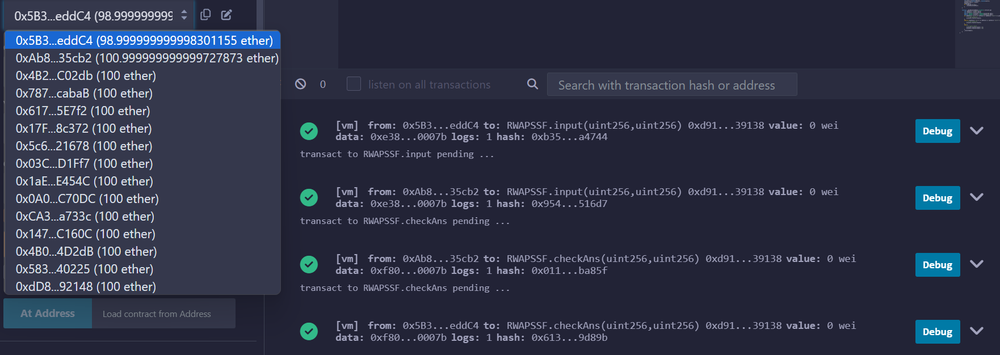

#### Rock=0, Fire=1, Scissors=2, Sponge=3, Paper=4, Air=5, Water=6
## ส่วนที่เพิ่มเข้ามา
### checkIfRegis
    -เเก้ปัญหาเรื่อง account ไหนเป็น idx ที่ 0 หรือ 1 โดยการไล่ดูเลยว่า account ที่ส่งเข้ามาตรงกับ account ที่ idx 0 หรือ 1
    รึเปล่า
### withdraw
    -เเก้ปัญหาเรื่องลงเงินไปเเล้วเอาออกมาไม่ได้เเบ่งเป็น 3 เคส
        -ไม่มีผู้เล่นอีกคนเข้ามา สามารถถอนออกได้เสมอ
        -มีผู้เล่น 2 คนเเล้วจะถอนได้ก็ต่อเมื่อเวลาของผู้ที่เข้ามาช้ากว่าหมดลงเเล้ว เเละผู้เล่นที่ต้องการถอนต้องเลือก choice
        เเล้วส่วนผู้เล่นอีกคนต้องยังไม่ได้เลือก choice โดยผู้ที่ถอนได้สำเร็จจะถือว่าชนะไปโดยปริยาย
        -เป็นขั้นตอนการ Reveal ถ้าเกิดว่าผู้เล่นที่จะถอน Reveal เเล้วเเละเวลาทั้งคู่หมดเเล้ว
        ผู้ที่ทำการถอนได้จะถือว่าชนะไปโดยปริยาย (เมื่อ reveal ทั้งคู่เเล้วจะเรียก _checkWinnerAndPay ทันที)
### _restartGame
    -reset ค่าต่างๆสำหรับการเริ่มตาใหม่โดยไม่ต้อง Deploy ใหม่
### checkAns
    -เพื่อทำในส่วน Reveal โดยผู้เล่นทั้งคู่ต้องเลือก choice ก่อนจึงจะมาทำในส่วนนี้ได้
## ส่วนที่เเก้ไข
### struct Player
    -เพิ่ม depositTime เข้ามาเพื่อเก็บเวลาที่ผู้เล่นเริ่มเข้ามา
### struct Ans
    -เพื่อเอาไว้เก็บ choice หลังเฉลย
### _checkWinnerAndPay
    -เเก้เงื่อนไขการชนะโดยเปลี่ยนเป็น ถ้าบวกช้อยที่เลือกเพิ่มเข้าไป 1 หรือ 2 หรือ 3 เเล้ว mod 7
    จะเท่ากับ ช้อยที่เเพ้ช้อยที่เลือก
### input
    -ในส่วนนี้จะเพิ่มการ commit สำหรับกระบวนการ commit-reveal มาด้วย
    -เมื่อใส่ input เเล้วก็จะเริ่มจับเวลาในส่วนของการทำ reveal ต่อด้วย

## ทดสอบกรณีต่างๆ
### กรณีถอนออก(withdraw)
#### เคส1 : มีผู้เล่นเข้ามาเเค่คนเดียว
สามารถถอนออกเมื่อไหร่ก็ได้

#### เคส2 : มีผู้เล่น 2 คนเเต่มีคนหนึ่งยังไม่ได้เลือก choice
ผู้ที่ต้องการถอนยังไม่ได้ใส่ input (หรือยังไม่หมดเวลา)
 
ยังถอนทันทีไม่ได้หลังจากใส่ input เข้าไปเเต่เมื่อเวลาหมดเเล้วถอนได้ปกติ 

#### เคส3 : ถอนในขั้นตอน Reveal
สามารถถอนได้ก็ต่อเมื่อเวลาที่เริ่มนับใหม่ หมดทั้งคู่เเล้วเเละคนที่ขอถอน ทำReveal ไปเเล้วในขณะที่ อีกคนยังไม่ได้ ทำReveal

### กรณีเสมอ
ผู้เล่นทั้ง 2 เลือก choice 0 ทั้งคู่

### กรณีเเพ้-ชนะ
ผู้เล่นที่ 0 เลือก choice 2

ผู้เล่นที่ 1 เลือก choice 6

ผลเเพ้-ชนะ -> ผู้เล่นที่ 1 ชนะเนื่องจาก Water=6 ชนะ Scissors=2

    